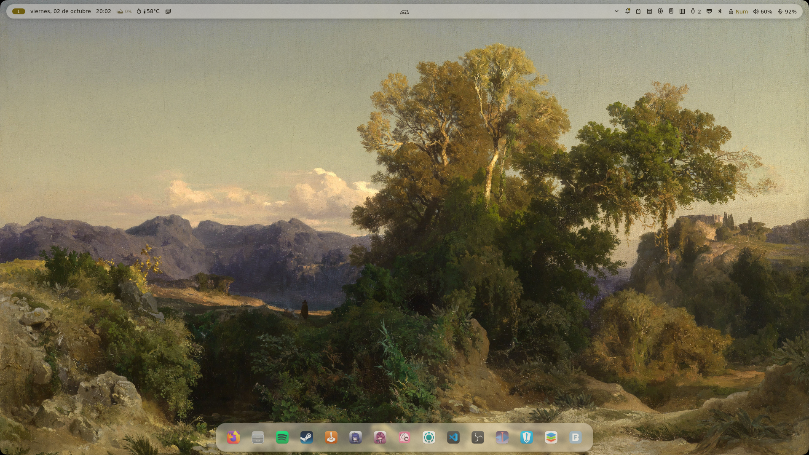
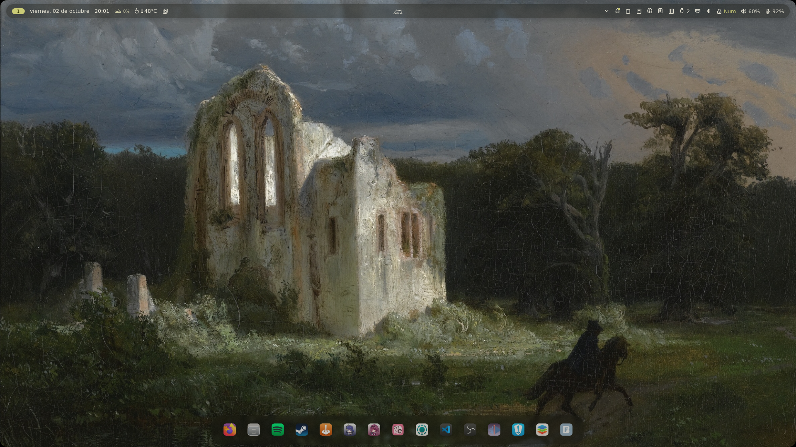
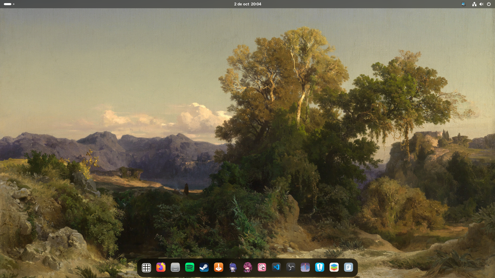
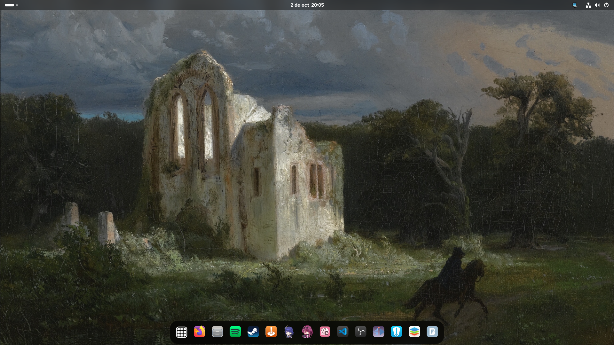

# Korunix

Esta es mi configuración de NixOS, pensada para que cada equipo quede con lo que yo quiero y sin tener que recordar qué instalé, qué dejé y cómo lo dejé.

NixOS es una distro de Linux que se configura de forma declarativa. Eso quiere decir que el sistema se define en archivos y luego Nix lo aplica por sí solo. Es mucho más ordenado que ir haciendo cambios y después no acordarse de nada.

Los flakes son la parte que ayuda a organizar todo eso. Son la forma en que NixOS ordena la configuración para que no quede mezclado todo, y para que se pueda reutilizar y compartir más fácil.

Esto no es para cualquier distro, sino para NixOS. Para usarlo hay que tener flakes activados.

## Cómo activar flakes

En NixOS esto se activa en el archivo principal de configuración del sistema, normalmente en

`/etc/nixos/configuration.nix`

y se agrega esto

```nix
nix = {
  settings = {
    experimental-features = [ "nix-command" "flakes" ];
  };
};
```

Después se aplica con

```bash
sudo nixos-rebuild switch
```

## Dónde está la configuración

La configuración real está en

`/home/koru/.korunix`

Dentro hay varias partes importantes:

- `flake.nix` es el archivo principal
- `equipos/` tiene la configuración de cada máquina
- `aplicaciones/` guarda los programas
- `apariencia/` guarda temas, fondos y escritorio
- `modulos/base/` guarda ajustes generales del sistema
- `plantilla-equipo/` sirve como base para otra computadora

Si alguien quiere usar esto en otra máquina, lo primero es entrar a `equipos/` y revisar la carpeta del equipo que quiere replicar. Por ejemplo, mi equipo principal está en

`/home/koru/.korunix/equipos/veskalia/equipo.nix`

Ahí se define el canal, la arquitectura, la persona del sistema y otros datos clave.

## Importante

El nombre del equipo tiene que coincidir con el nombre de la carpeta del equipo, pero aquí no hace falta hacer más ajustes manuales. La configuración se detecta sola.

Por ejemplo, si cambias la carpeta de `veskalia` a `mi-nueva-maquina`, esa nueva carpeta ya pasa a ser el equipo nuevo. Nix lo detecta automáticamente porque la estructura de la carpeta y la configuración están conectadas entre sí.

No hace falta ir cambiando nombres en varios archivos a mano. La carpeta ya funciona como identificador del equipo.

## Mi equipo principal

Veskalia es la máquina que más uso. Aquí tengo el escritorio en Umbriel, con un estilo limpio y más cómodo para trabajar.





También tengo una versión con GNOME para ciertos usos.





## Qué hace esto

La idea es simple: dejar el sistema definido de una vez y no depender de la memoria. Yo lo uso para que:

- cada equipo tenga su propia configuración
- no tenga que recordar qué instalé
- pueda cambiar cosas sin romper el sistema
- pueda reutilizar ideas en otra máquina
- pueda compartir lo que hice para que otros aprendan o adapten

## Cómo se usa

Después de activar flakes, se usan estos atajos

- `just revisar` para comprobar que todo esté bien
- `just probar veskalia` para preparar la configuración de la máquina
- `just switch veskalia` para aplicarla
- `just formatear` para ordenar los archivos
- `just actualizar` para buscar cambios nuevos
- `just volver` para regresar a la versión anterior
- `just limpiar` para borrar cosas viejas

`just` es solo un atajo para ejecutar tareas comunes con nombres más cortos y más fáciles de recordar.

## En resumen

Korunix es mi setup personal de NixOS. Está pensado para que todo quede definido, ordenado y fácil de mantener. No es una guía general, sino una configuración real que uso para que mis equipos se vean bien y funcionen como yo quiero.
