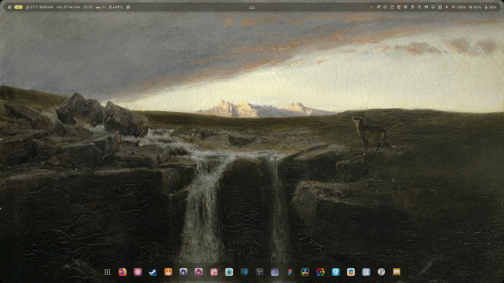
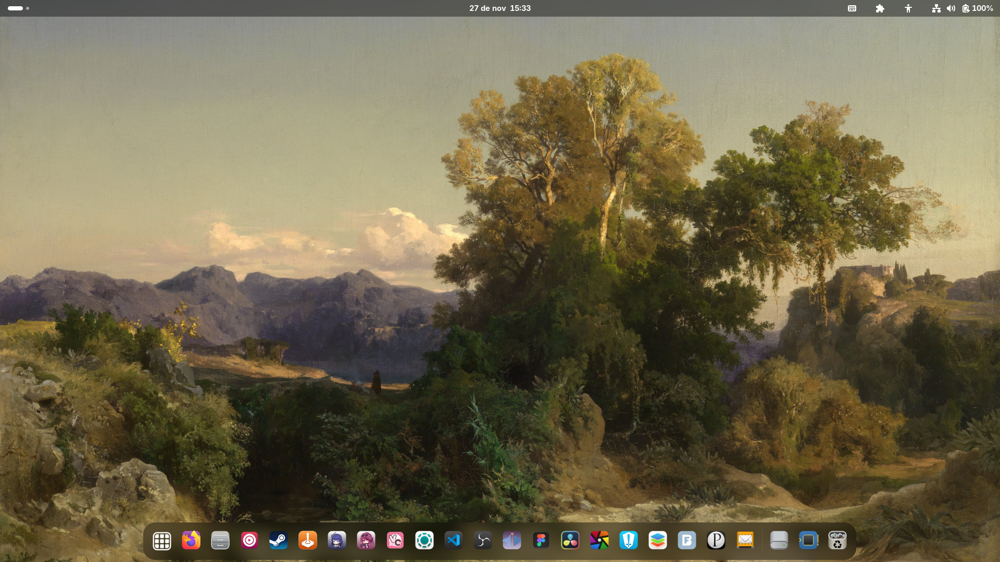
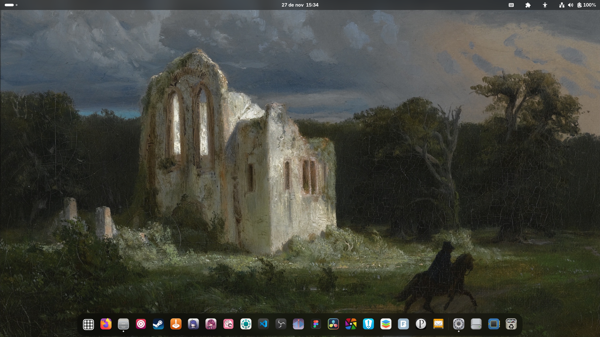

# Korunix

Esta es la configuración de NixOS de Veskalia, mi ASUS ROG Ally (RC71L) con AMD Ryzen Z1 Extreme.

Aquí tengo todo lo que necesito para reinstalar el sistema sin tener que configurar todo de nuevo.

## ¿Qué es NixOS?

NixOS es una distribución de Linux que permite configurar el sistema mediante archivos `.nix`. En ellos se definen los programas, servicios, usuarios, controladores y demás ajustes del equipo.

Esto permite reproducir una configuración desde cero o volver a una anterior si algo deja de funcionar.

### Flakes

Los flakes permiten reunir una configuración de Nix y sus dependencias en un mismo proyecto. En `flake.nix` se definen las dependencias y en `flake.lock` se guardan sus versiones exactas.

### Sin Home Manager

Home Manager permite gestionar los programas y las configuraciones de cada usuario de forma declarativa.

Korunix no lo utiliza. Toda la configuración se gestiona desde los propios módulos de NixOS.

## Escritorios

Desde la pantalla de inicio de sesión puedes elegir entre tres sesiones.

### Umbriel + Noctalia

Umbriel es un compositor Wayland que organiza las ventanas en columnas desplazables.

Noctalia se encarga de los paneles, el dock, las notificaciones, los controles del sistema y la apariencia del escritorio. Luciole es el explorador de archivos.

| Claro | Oscuro |
| --- | --- |
|  |  |

### GNOME

Un entorno de escritorio con soporte para gestos táctiles, teclado en pantalla y extensiones.

Comparte los colores, los fondos de pantalla y buena parte de la apariencia de Noctalia. Incluye GSConnect para conectar el celular desde GNOME.

| Claro | Oscuro |
| --- | --- |
|  |  |

### Modo consola

Una sesión de Steam Big Picture sobre Gamescope, similar a la de SteamOS.

Incluye Decky Loader y CSS Loader para personalizar Steam. Los complementos y los temas se instalan automáticamente, con mis ajustes de apariencia y los iconos de los mandos de la Ally.

Handheld Daemon se encarga de los mandos integrados, los botones especiales y el consumo de energía de la Ally.

También están disponibles Heroic, Lutris y Prism Launcher.

## NixDeck

NixDeck se encarga de la emulación dentro de Korunix. Utiliza Steam ROM Manager para integrar los juegos de otras consolas en la biblioteca de Steam.

Los juegos, las partidas guardadas y las configuraciones de los emuladores se almacenan en una microSD. La tarjeta se reconoce por la etiqueta NixDeck, aunque se cambie por otra. El sistema puede arrancar con o sin ella.

| Consola | Emulador |
| --- | --- |
| PlayStation | DuckStation |
| PlayStation 2 | PCSX2 |
| PlayStation 3 | RPCS3 |
| PSP | PPSSPP |
| GameCube y Wii | Dolphin |
| Wii U | Cemu |
| Nintendo Switch | Eden |
| Nintendo 3DS | Azahar |
| Nintendo DS | melonDS |
| Game Boy Advance | mGBA |
| Xbox 360 | Xenia |

También incluye PepoMote, que permite utilizar el celular como mando.

DuckStation y Xenia se descargan y actualizan automáticamente al configurar o sincronizar NixDeck. Los demás emuladores se instalan desde Nixpkgs.

NixDeck sigue en desarrollo. No incluye juegos, BIOS ni claves de las consolas.

## Aplicaciones

Figma, Darktable, GIMP, Inkscape, Blender, Kdenlive, DaVinci Resolve, OBS, BirdFont, FontForge, Obsidian, LibreOffice, OnlyOffice y Visual Studio Code, entre otras.

La mayoría se instala desde Nixpkgs, aunque también se utilizan Flatpak y AppImage.

## Apariencia

Los colores del sistema se generan a partir del fondo de pantalla mediante Noctalia y se comparten entre los escritorios y las aplicaciones compatibles.

Los fondos están divididos en dos colecciones, una para el día y otra para la noche. El modo claro y oscuro cambia automáticamente según la posición del sol.

El tema de iconos es Hatter y el cursor es Bibata.

## Otros detalles

- Lector de huellas de la ROG Ally.
- Reducción de ruido del micrófono.
- Acceso remoto mediante Tailscale y SSH.
- Transmisión de juegos mediante Sunshine.
- Transferencia de archivos mediante LocalSend.
- Duplicación de pantalla mediante UxPlay.
- Integración con iPhone mediante [Tether](https://github.com/zackb/tether), incluida la posibilidad de usarlo como webcam.
- Compatibilidad con AppImages.
- Limpieza automática de generaciones antiguas de NixOS.

## Compatibilidad

Korunix está configurado para la ASUS ROG Ally original (RC71L) con AMD Ryzen Z1 Extreme.

Para instalarlo en otro equipo es necesario adaptar la configuración del hardware, las particiones y el usuario. El repositorio incluye una plantilla para ello.

No es una distribución independiente, sino una configuración de NixOS.

## Documentación

- [Instalación y mantenimiento](docs/configuracion-y-mantenimiento.md)
- [Estructura y personalización](docs/personalizacion.md)
- [NixDeck](docs/nixdeck.md)

## Créditos

- [NixOS y Nixpkgs](https://github.com/NixOS/nixpkgs) y [NixOS Hardware](https://github.com/NixOS/nixos-hardware).
- [Umbriel](https://github.com/noctalia-dev/umbriel), [Noctalia](https://github.com/noctalia-dev/noctalia), [Luciole](https://github.com/noctalia-dev/luciole) y [GNOME](https://www.gnome.org/).
- [Hatter](https://github.com/Mibea/Hatter), [Bibata](https://github.com/ful1e5/Bibata_Cursor) y [ChromaLeon](https://github.com/Fabito02/ChromaLeon).
- [Handheld Daemon](https://github.com/hhd-dev/hhd), [Gamescope](https://github.com/ValveSoftware/gamescope), [Decky Loader](https://github.com/SteamDeckHomebrew/decky-loader), [Steam ROM Manager](https://github.com/SteamGridDB/steam-rom-manager) y [PepoMote](https://github.com/PepoTechYT/PepoMote).
- [CSS Loader](https://github.com/DeckThemes/SDH-CssLoader) y los autores de los [temas de DeckThemes](https://deckthemes.com/).
- [Tether](https://github.com/zackb/tether), [GSConnect](https://github.com/GSConnect/gnome-shell-extension-gsconnect), [GStreamer](https://gstreamer.freedesktop.org/), [FFmpeg](https://ffmpeg.org/) y [v4l2loopback](https://github.com/umlaeute/v4l2loopback).

La receta de Decky está adaptada de [Jovian-NixOS](https://github.com/Jovian-Experiments/Jovian-NixOS) y varios temas provienen de las [plantillas de la comunidad de Noctalia](https://github.com/noctalia-dev/community-templates).

[Avisos de terceros](LICENSES/third-party-notices.txt)

## Licencia

El código propio y la documentación de Korunix se comparten bajo la [licencia MIT](LICENSE). Los fondos de pantalla, las capturas y el material de terceros no están cubiertos por esta licencia; cada uno conserva las condiciones que le corresponden. Consulta los [avisos de terceros](LICENSES/third-party-notices.txt).
